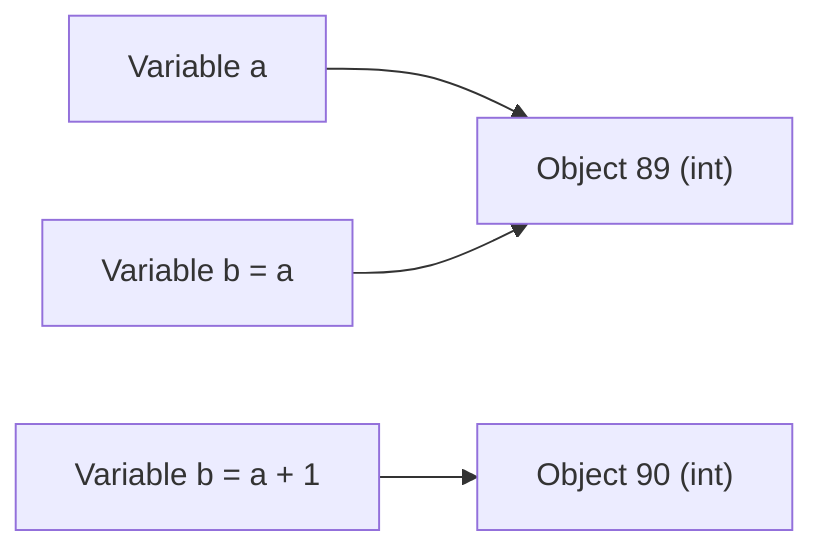
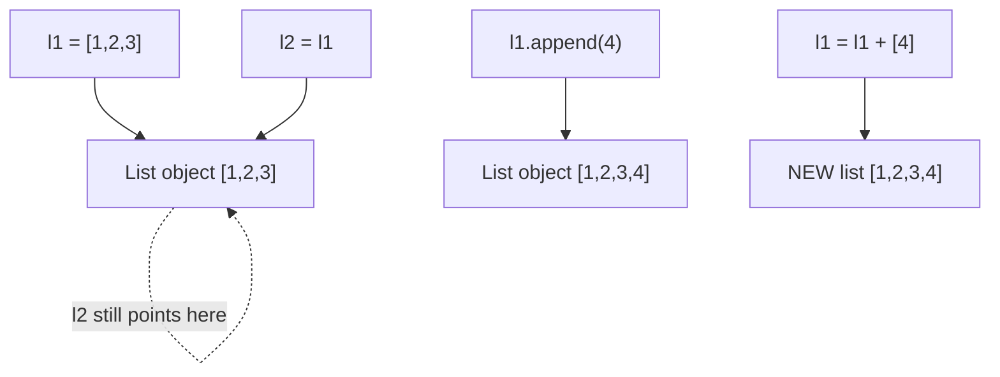
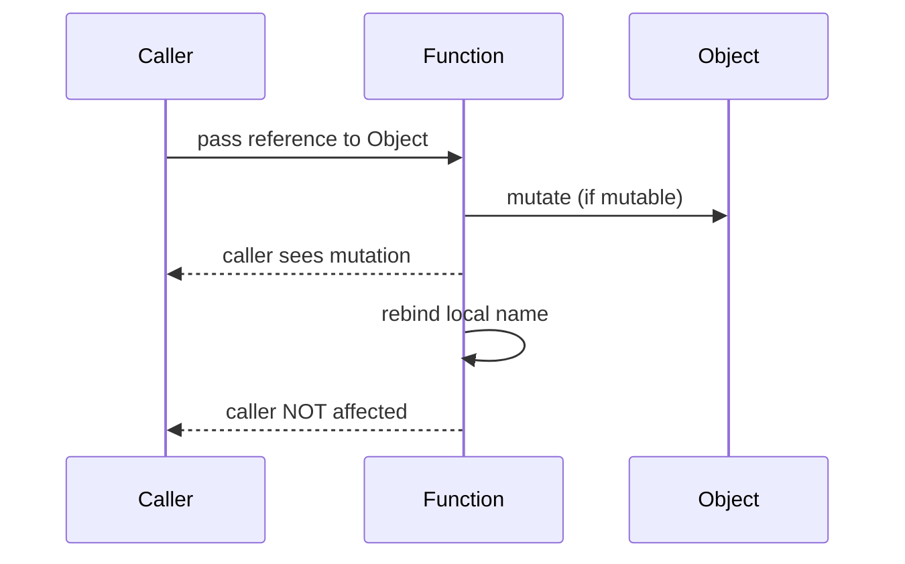

# Python - Everything Is Object

This project explores Python object fundamentals: object identity, references, aliasing, mutability vs immutability, and how function arguments are passed by assignment (object reference).

## Learning Objectives

- Understand that everything in Python is an object.
- Use `id()` and `type()` to inspect object identity and object type.
- Explain the difference between `==` (value equality) and `is` (object identity).
- Identify aliasing and how multiple variable names can reference one object.
- Distinguish mutable objects from immutable objects.
- Predict behavior differences between in-place mutation and rebinding.
- Explain how arguments are passed to functions in Python and resulting side effects.
- Implement a shallow copy of a list using slicing.

## Requirements

- Ubuntu 20.04 LTS
- Python 3.8.5
- `pycodestyle` 2.7.*
- All `.txt` answers are exactly one line, no leading/trailing spaces, newline at EOF.
- All `.py` files start with `#!/usr/bin/python3`.
- Python files are executable and newline-terminated.
- `19-copy_list.py` must have no imports and exactly 3 lines.

## Answer Table

| Task | Question Summary | File | Answer | Reasoning |
| --- | --- | --- | --- | --- |
| 0 | Built-in to print object type | `0-answer.txt` | `type` | `type()` returns the class/type of the object. |
| 1 | Built-in to get object identity | `1-answer.txt` | `id` | `id()` returns the identity (address-like value) of an object. |
| 2 | Are `a=89` and `b=100` same object? | `2-answer.txt` | `No` | Different integer values map to different objects here. |
| 3 | Is `a=89`, `b=89` same object? | `3-answer.txt` | `Yes` | CPython small-int caching typically reuses the same `89` object. |
| 4 | Is `b=a` same object? | `4-answer.txt` | `Yes` | Assignment aliases the exact same object. |
| 5 | Is `a` same as `a+1` object? | `5-answer.txt` | `No` | `a+1` creates a new integer object. |
| 6 | Do aliased strings compare equal with `==`? | `6-answer.txt` | `True` | Same value and same referenced string. |
| 7 | Are aliased strings identical with `is`? | `7-answer.txt` | `True` | Aliasing means both names reference one object. |
| 8 | Do equal string literals compare equal? | `8-answer.txt` | `True` | Equal literal values make `==` true. |
| 9 | Are short identical string literals identical? | `9-answer.txt` | `True` | Interning can make short literals reference the same object. |
| 10 | Lists with same contents and `==` | `10-answer.txt` | `True` | `==` compares list contents, not identity. |
| 11 | Two list literals and `is` | `11-answer.txt` | `False` | Separate list literals create distinct objects. |
| 12 | `l2=l1` then compare with `==` | `12-answer.txt` | `True` | Same object implies same content. |
| 13 | `l2=l1` then compare with `is` | `13-answer.txt` | `True` | Aliasing means identical object identity. |
| 14 | Effect of `append` on aliased list | `14-answer.txt` | `[1, 2, 3, 4]` | `append` mutates the list in place, visible via alias. |
| 15 | Effect of `l1 = l1 + [4]` on alias | `15-answer.txt` | `[1, 2, 3]` | `+` creates a new list and rebinds only `l1`. |
| 16 | Rebinding int inside function | `16-answer.txt` | `1` | Int is immutable; local rebind does not affect caller. |
| 17 | Appending to list inside function | `17-answer.txt` | `[1, 2, 3, 4]` | Mutation of shared list object affects caller. |
| 18 | Reassign list parameter in function | `18-answer.txt` | `[1, 2, 3]` | Local parameter rebinding does not change caller binding. |
| 19 | Copy list implementation | `19-copy_list.py` | `return a_list[:]` | Slice without bounds creates a shallow list copy. |
| 20 | Is `()` a tuple? | `20-answer.txt` | `Yes` | Empty parentheses literal is an empty tuple. |
| 21 | Is `(1, 2)` a tuple? | `21-answer.txt` | `Yes` | Comma-separated values in parentheses make tuple literal. |
| 22 | Is `(1)` a tuple? | `22-answer.txt` | `No` | Parentheses alone around one value do not create tuple. |
| 23 | Is `(1,)` a tuple? | `23-answer.txt` | `Yes` | Trailing comma creates one-element tuple. |
| 24 | Identity of `(1)` and `(1)` | `24-answer.txt` | `True` | Both evaluate to cached small int `1`. |
| 25 | Identity of separate `(1, 2)` tuples | `25-answer.txt` | `False` | Separate tuple constructions are not guaranteed identical. |
| 26 | Identity of `()` and `()` | `26-answer.txt` | `True` | Empty tuple is a CPython singleton. |
| 27 | Identity after `a = a + [5]` | `27-answer.txt` | `No` | New list object is created and rebound. |
| 28 | Identity after `a += [4]` | `28-answer.txt` | `Yes` | In-place list extension keeps same object id. |
| 29 | Blog post deliverable | `29-blog_post.md` | `Draft + placeholder URLs` | Full publish-ready article with required topics and examples. |

## Mermaid Diagrams

### Flowchart - Assignment and aliasing



### Flowchart - Mutable vs immutable rebinding vs mutation



### Sequence diagram - Pass-by-assignment



## How To Test Manually

Run commands from this directory:

```bash
cd python-everything_is_object
```

| Task | Command | Expected output |
| --- | --- | --- |
| 0 | `cat 0-answer.txt` | `type` |
| 1 | `cat 1-answer.txt` | `id` |
| 2 | `cat 2-answer.txt` | `No` |
| 3 | `cat 3-answer.txt` | `Yes` |
| 4 | `cat 4-answer.txt` | `Yes` |
| 5 | `cat 5-answer.txt` | `No` |
| 6 | `cat 6-answer.txt` | `True` |
| 7 | `cat 7-answer.txt` | `True` |
| 8 | `cat 8-answer.txt` | `True` |
| 9 | `cat 9-answer.txt` | `True` |
| 10 | `cat 10-answer.txt` | `True` |
| 11 | `cat 11-answer.txt` | `False` |
| 12 | `cat 12-answer.txt` | `True` |
| 13 | `cat 13-answer.txt` | `True` |
| 14 | `cat 14-answer.txt` | `[1, 2, 3, 4]` |
| 15 | `cat 15-answer.txt` | `[1, 2, 3]` |
| 16 | `cat 16-answer.txt` | `1` |
| 17 | `cat 17-answer.txt` | `[1, 2, 3, 4]` |
| 18 | `cat 18-answer.txt` | `[1, 2, 3]` |
| 19 | `python3 -c "copy_list=__import__('19-copy_list').copy_list; a=[1,2,3]; b=copy_list(a); print(b); print(a == b); print(a is b)"` | `[1, 2, 3]` then `True` then `False` |
| 20 | `cat 20-answer.txt` | `Yes` |
| 21 | `cat 21-answer.txt` | `Yes` |
| 22 | `cat 22-answer.txt` | `No` |
| 23 | `cat 23-answer.txt` | `Yes` |
| 24 | `cat 24-answer.txt` | `True` |
| 25 | `cat 25-answer.txt` | `False` |
| 26 | `cat 26-answer.txt` | `True` |
| 27 | `cat 27-answer.txt` | `No` |
| 28 | `cat 28-answer.txt` | `Yes` |
| 29 | `grep "^- Medium:" 29-blog_post.md && grep "^- LinkedIn:" 29-blog_post.md` | `- Medium: ...` and `- LinkedIn: ...` |

To apply executable permissions for script files:

```bash
./setup.sh
```

Expected output:

```text
Executable permissions updated.
```

## Key Takeaways

- Everything in Python is an object.
- `==` checks value equality, while `is` checks identity.
- CPython may intern short strings and cache small integers.
- Aliasing means multiple names reference one object.
- Mutable objects can change in place; immutable objects cannot.
- `+` often creates a new object, while `+=` may mutate in place.
- `a_list[:]` creates a shallow list copy.
- Function arguments are passed by assignment to object references.

## Author

Abdallah Yessine Kriaa, Holberton SAU-0225.
